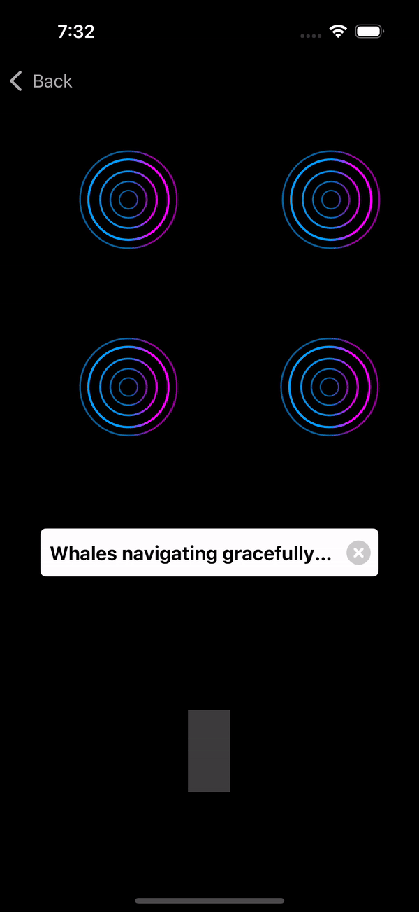
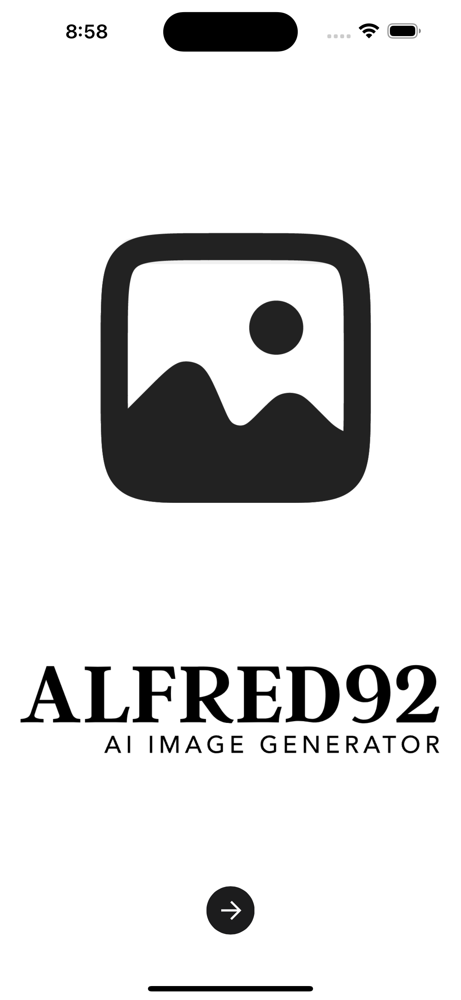
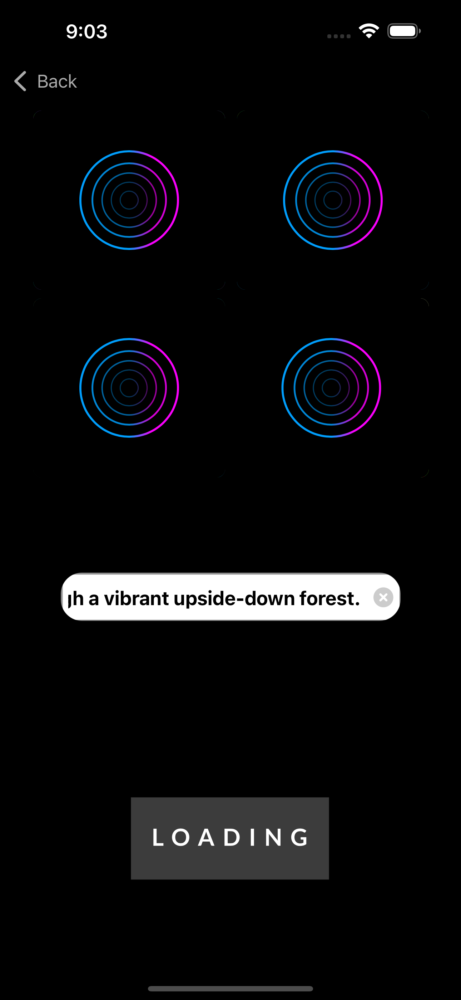
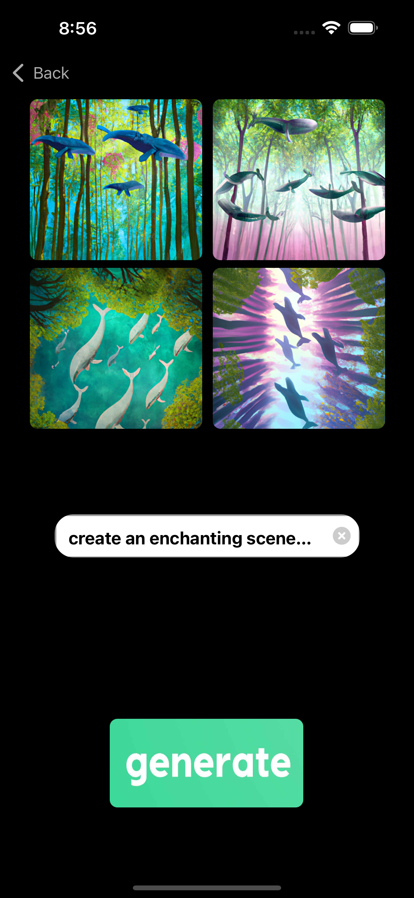
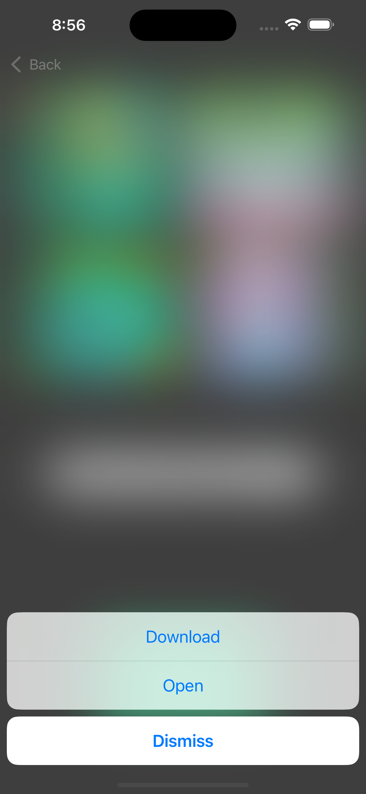
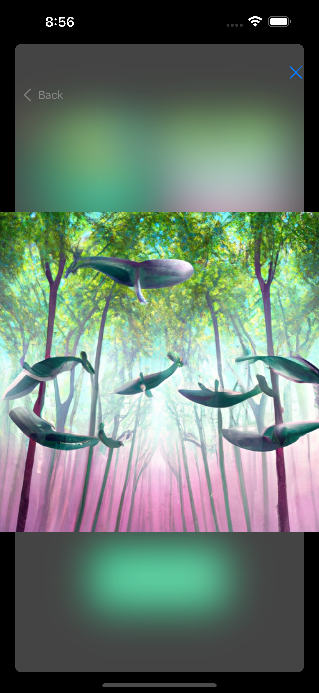

# ALFRED92

A minimalist tool that turns text prompts into captivating images using cutting-edge AI.

## 🚀 Key Features
- **Simple Interface:**
  - Effortless user experience with straightforward controls.

- **Instant Creations:**
  - Advanced AI transforms text into beautiful, creative images instantly.

- **On-the-Go Artistry:**
  - Minimalist design for generating stunning images anywhere.

## 💡 How to Use
1. **Enter Text Prompt:**
   - Input text in the clean, minimalistic interface.

2. **Generate Images:**
   - Tap the generate button for instant creative results.

3. **Enjoy Your Artworks:**
   - Explore and download images effortlessly in a clean grid layout.

# 📹 Video - Watch Alfred92 in ACTION

## 📷 Screenshots

## 🔮 Upcoming Feature
- **Color Picker:**
  - Select any point on an image to get the color code and corresponding name.

## 📋 System Requirements
- Compatible with iOS devices.
- Runs on most iOS devices without specific version requirements.

## 🌟 Conclusion
Alfred92 is your go-to for efficient image creation, combining simplicity with AI power.

